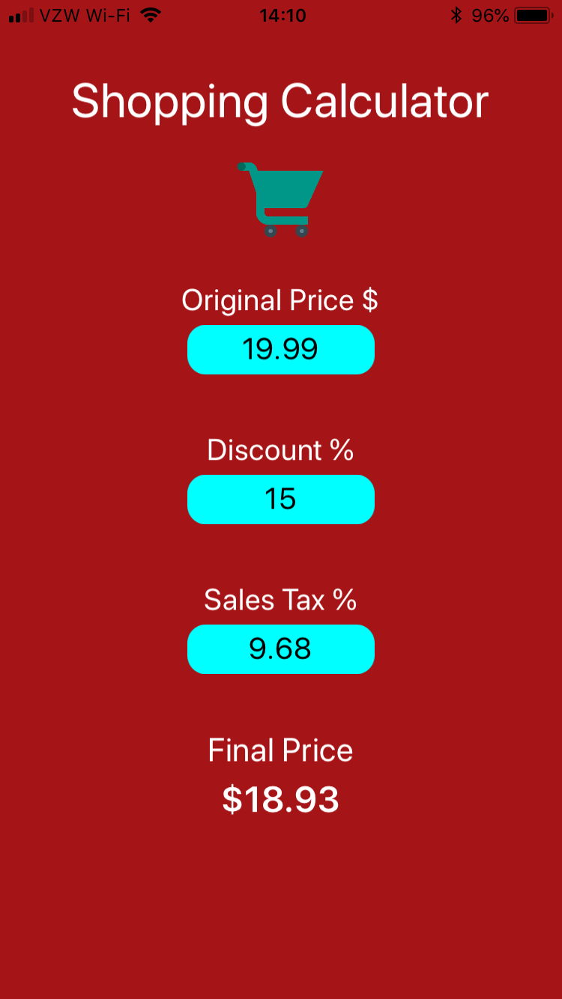

# Shopping Calculator

First lab for CSE 438 Mobile App Development. Simple shopping calculator app. This app was made in Xcode, using swift, and was done all programmatically.

 

 

This app includes a hidden feature. If you click on the shopping cart image, it will use location services to get your current coordinates. It takes theses coordinates and uses the Geolocator to get the current state. The app then looks up the state and finds the average sales tax and fills out the sales tax field in the app for you.

